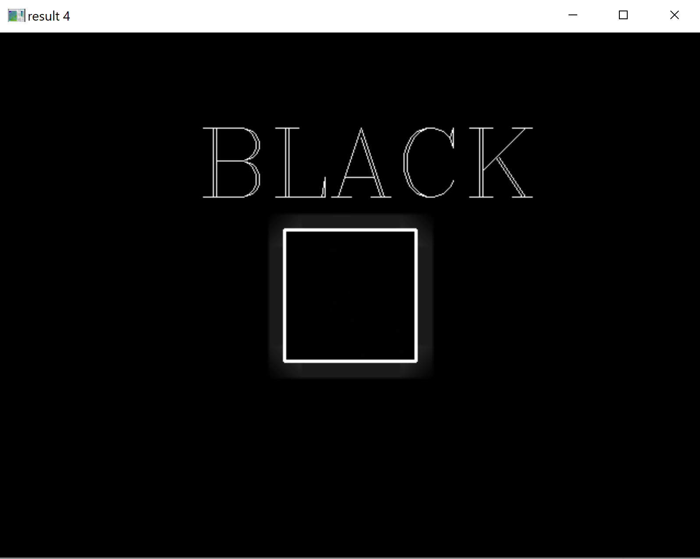
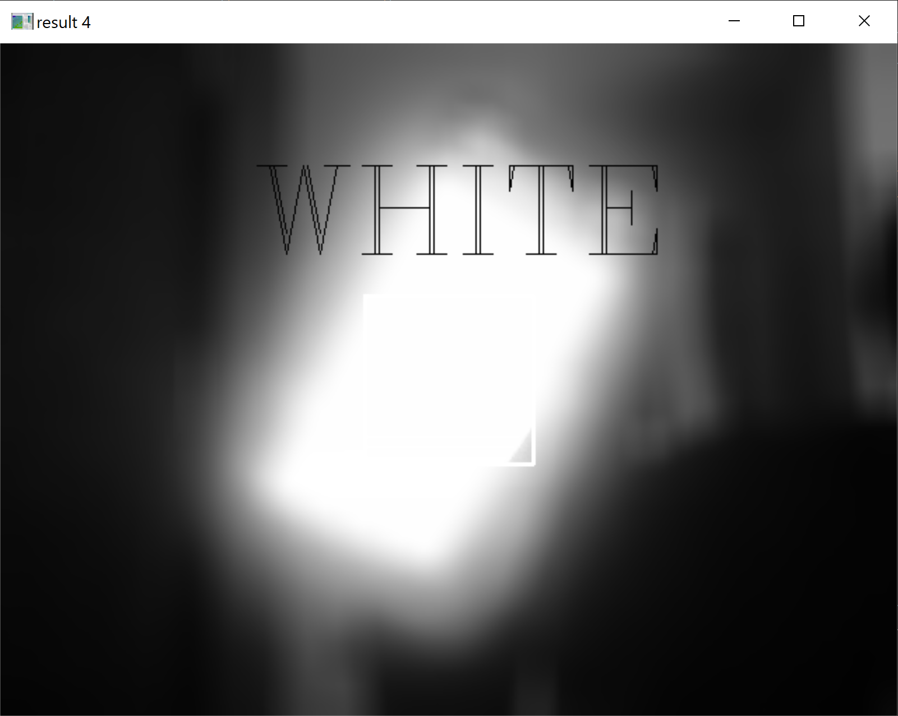
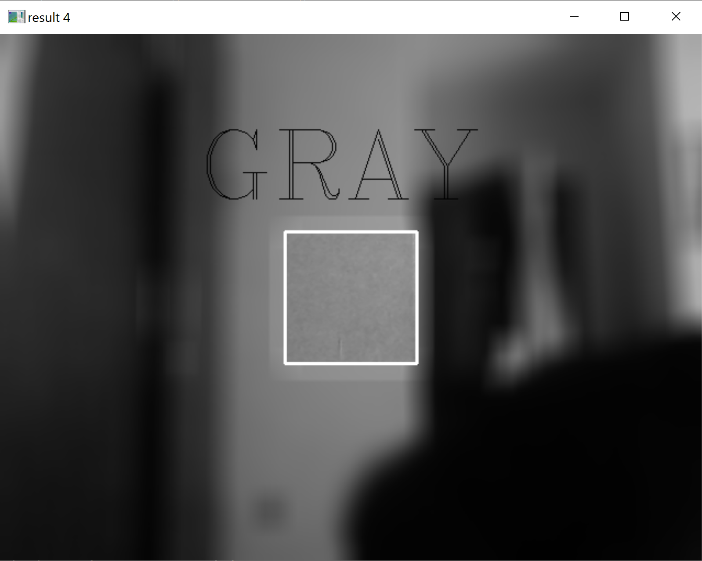

** ASSIGNMENT 27 PICTURS **

27-1-INPUT

27-1-OUTPUT

27-2-INPUT

27-2-OUTPUT is a video ( There is a picture of this video )

27-3-INPUT

27-3-OUTPUT is a video ( There is a picture of this video )

27-4-OUTPUT is a color detector :
A. Detect BLACK ⚫

B. Detect WHITE ⚪

C. Detect GRAY  🔘
