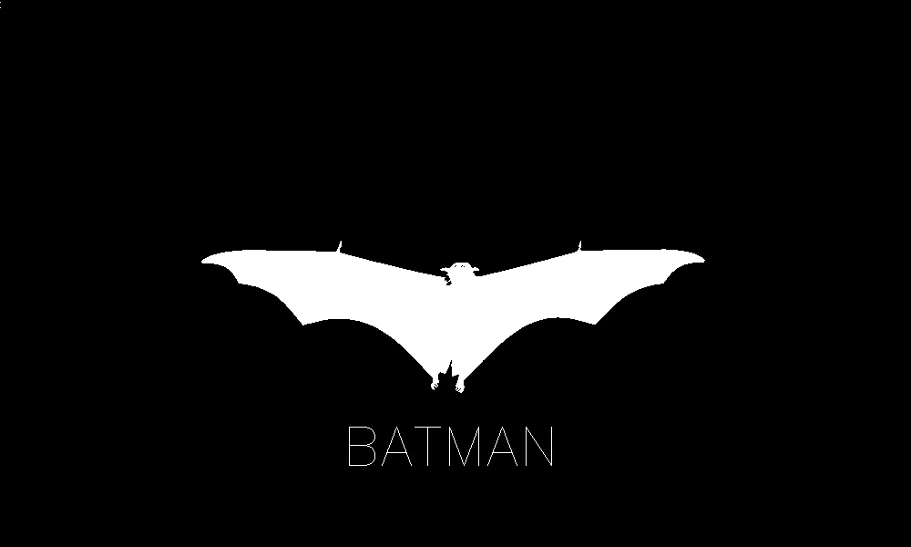
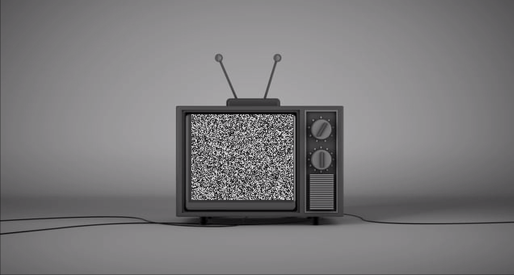
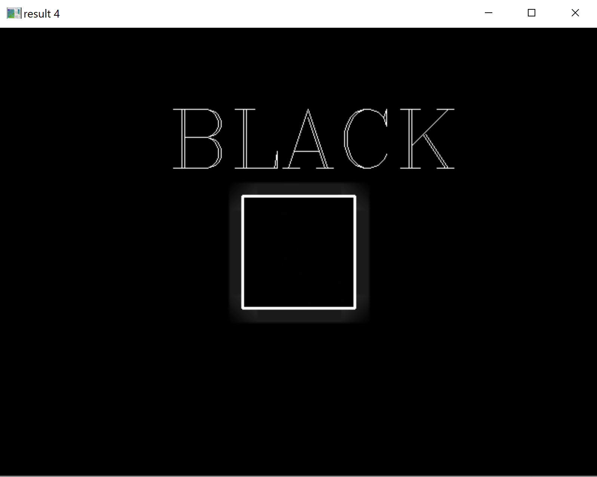
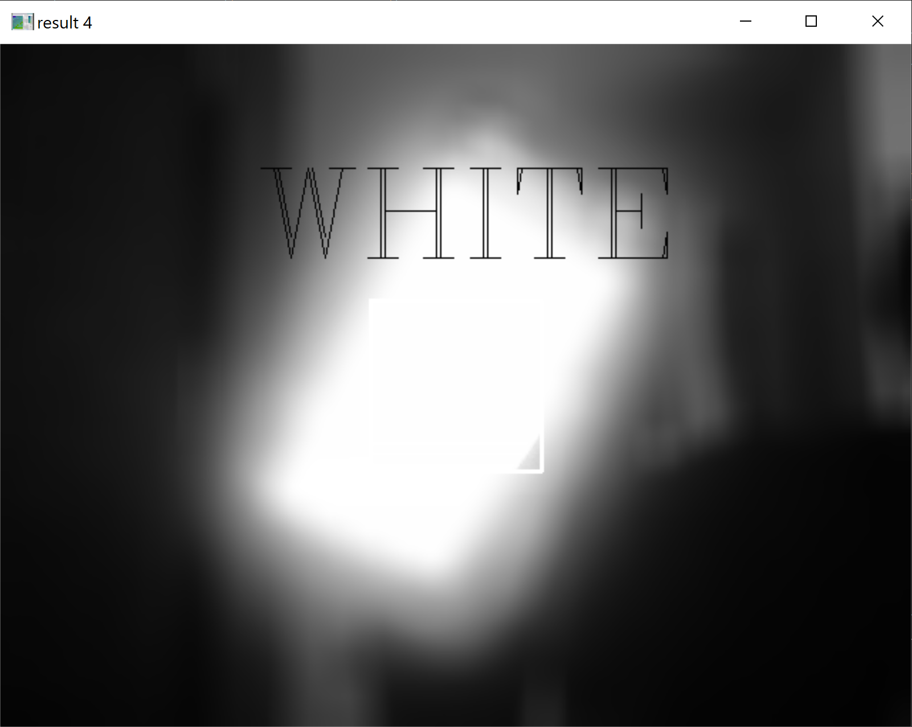
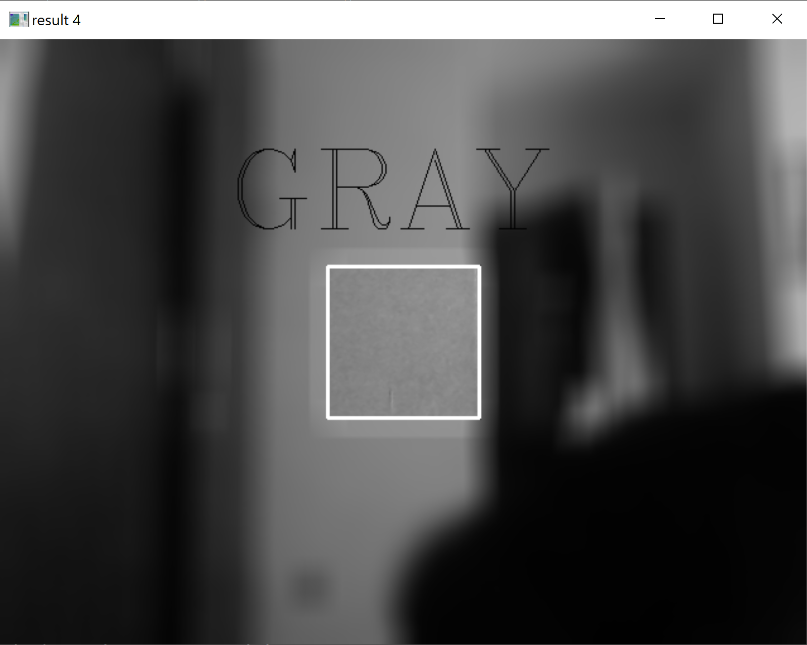

# ASSIGNMENT 27 PICTURS

## 27-1
Input :

Output :

## 27-2
Input :

Output is a video ( There is a picture of this video ) :

## 27-3
Input :

Output is a video ( There is a picture of this video ) :

## 27-4 : This is a color detector :
A. Detect BLACK ⚫

B. Detect WHITE ⚪

C. Detect GRAY  🔘
