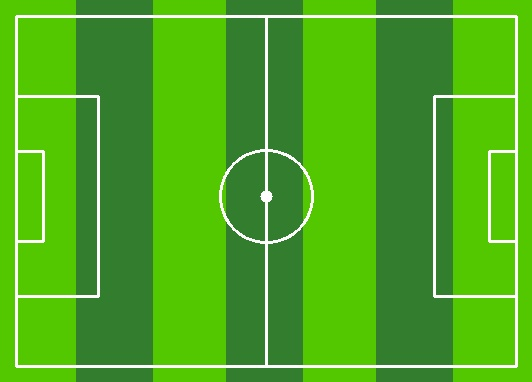
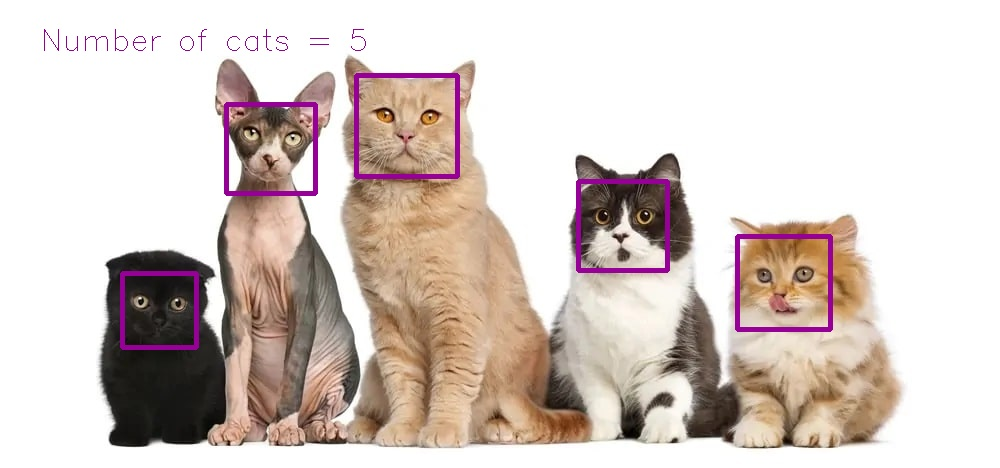

# Assignment28 : Face Detectoe

## How to Install
Run following command :
```
pip install -r requirments.txt
```
## First section in this assignment
You will see a Football Pitch by running this code.

result of this code :


## Second section in this assignment
This code is a Cat Detector, it will detect cats and draw a rectangle around their face.

result of this code :

## Third section in this assignment
This code need access to your webcam. This has four deferent filters.
1. By pressing 1, it will put a Panda Stiker on your face :


2. By pressing 2, it will put Glasses and lips on your face :


3. By pressing 3, it will make your face Checkered :


4. By pressing 4, it will make a Mirror picture :


## Remember
To exit any of my code, you just need to press 'q' botton