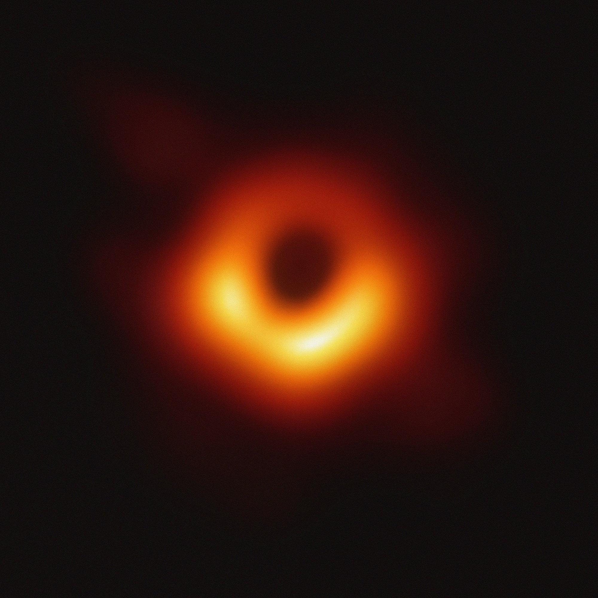
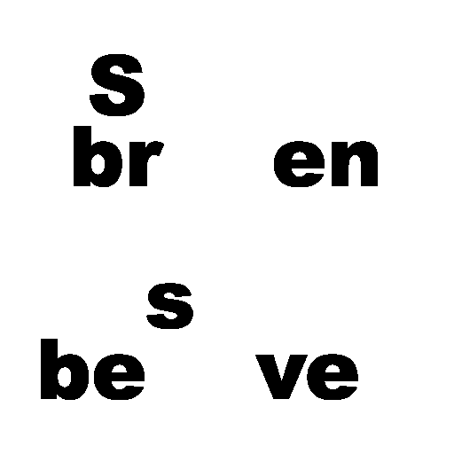
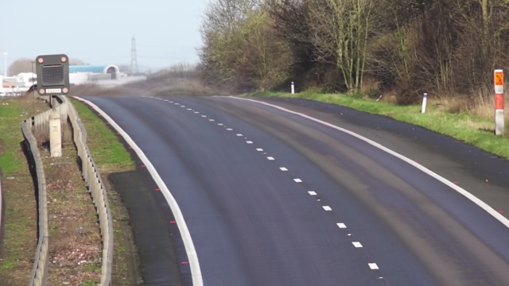
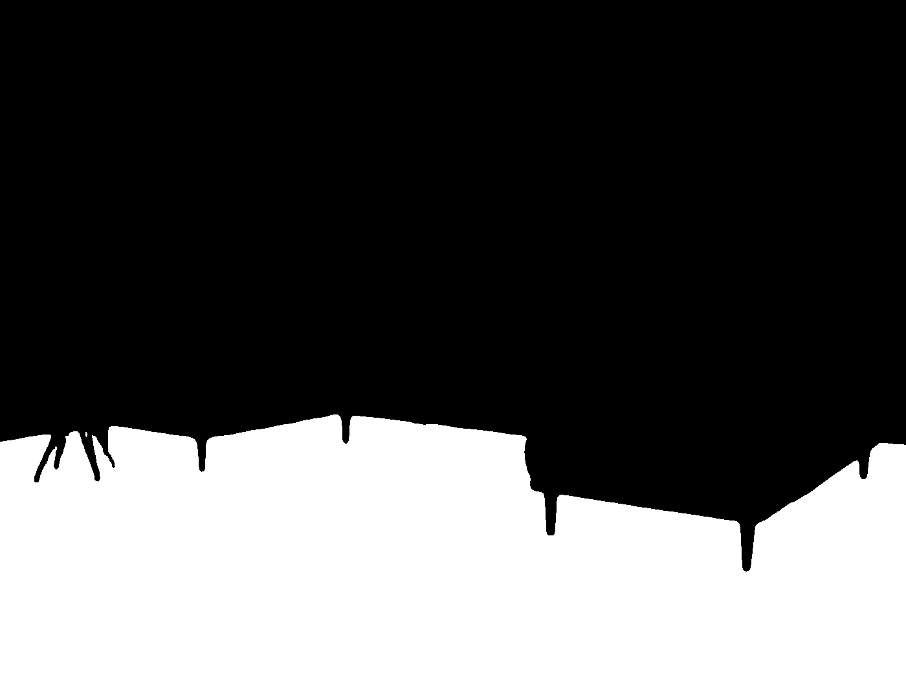
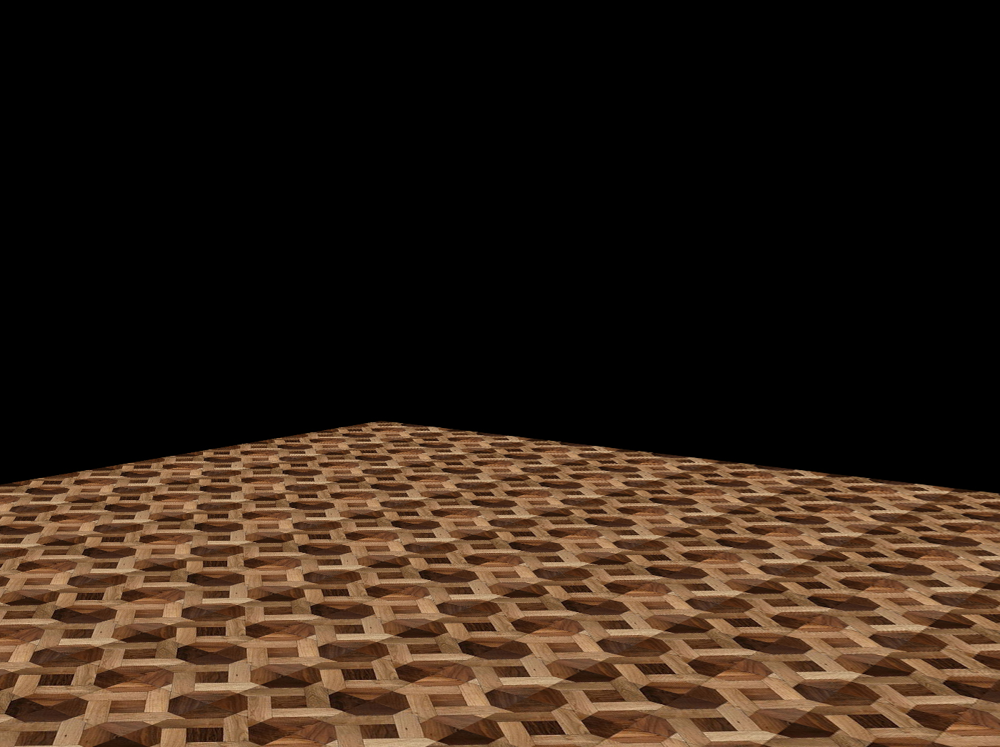
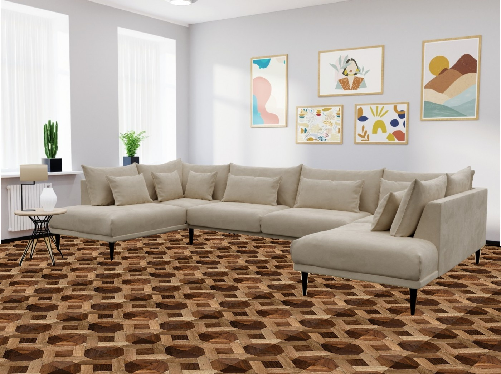

# assignment29 : Basic Math Operations

## How to Install
Run the following command :
```
pip install -r requirment.txt
```

## First part : Face Morphing
In this part we can see changes when it is turning the Hat-Maker to Jack Sparrow :


## Second part : Black Hole
By reducing the noise in different parts of this photo and stick them together the following picture appear:



## Third part : Photo to Sketch
the input photo is :


the sketch is :


## Fourth part : Find the Secret Text
The main text is :


And by using the below code breaker :



The secret massage will be :


## Fifth part : Background Estimation
In this part we used a video as an input and reach a photo from its background as an output :



## Sixth part : Virtual Decorator
By using the following mask :



This code decorate the floor of the following room by the following floor pictur :




The Decorated room is :

