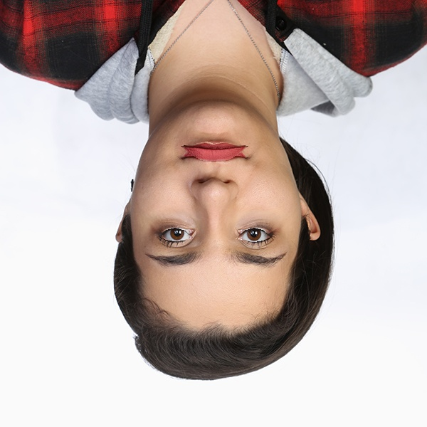

# Assignment30 : Face Alignment

## How to Install
Run following command :
```
pip install -r requirments.txt
```

## First part : Fruit and Vegetable Snapchat Filter
This is a cut filter, that put the mouth and eyes of the input picture on a fruit pictue.
To use this filter you should run the python code, which is named '1.py'.
This code output is :


## Second part : Rotate the Phone
This is both funny and scary filter, that you must roatate your device to see the scary image.
To use this filter you should run the python code, which is named '2.py'.
Use this code with photos with only one face in them (or the output wont be satisfactory).
This code output is :



## Thirs part : Align Face
This code will rotate your input picture specific amount to have a fice in a stright position.
To use this filter you should run the python code, which is named '3.py'.
This code input is :


This code output is :


## Fourth part : Big Eyes and Lips Filter
This is a funny filter, that doubles the size of the mouth and eyes of the input picture.
To use this filter you should run the python code, which is named '4.py'.
This code output is :

