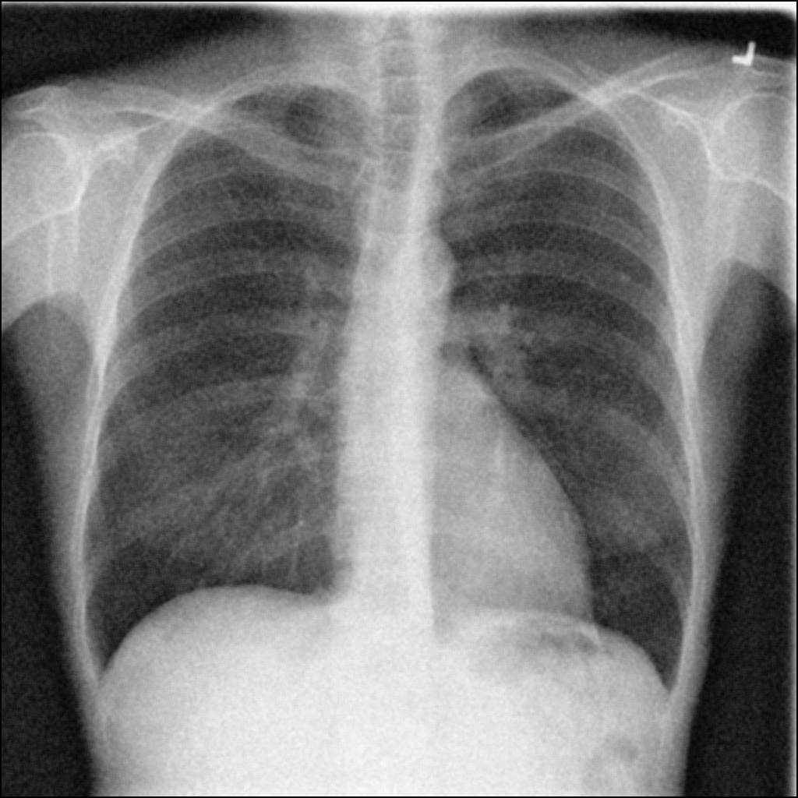

# Assignment30 : Convolution and Histogram

## How to Install
Run following command :
```
pip install -r requirments.txt
```

## First part : 

...

## Second part : 

...

## Thirs part : Edge Detection
In this assignment we use two different edge detection method to find the following pictures edge :


for the lion picture we used 'Sobel Operator', and the output is :


for the spider picture we used 'Laplacian Operator', and the result is:


## Fourth part : Vertical and Horizental Edge Detecion
In this assignment we use two different filter on a same picture, which you can see below :


one of the filters is a horizental edge detection. It bolds horizental edges in the picture and it will give us the following output:


the other filter is a vertical edge dection. It bolds vertical edges in the picture and it will give us the following output:


## Fifth part : Noise Reduction
In this assignment we use three noise reduction in diffrent scales on three diffrent photo :

first photo is a X-RAY photo :


second photo is an electronic board :


and third photo is a noisy picture of geometric shapes :


Each photo is filtered in three different scale : 3*3, 5*5, and 15*15.

first photo's result => 3*3 :

5*5 :

15*15 :

