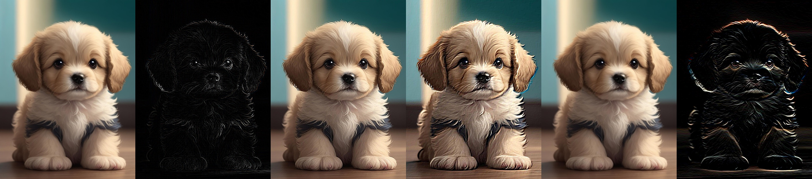

# Assignment30 : Convolution 2D and Histogram Equalization

## How to Install
Run following command :
```
pip install -r requirments.txt
```

## First part : Convolution 2D
In this assignment we convolved an image with five different kernel.
The order of pictures in the output photo are :
1. input image   2. image with edge detection filter   3. image with sharpening filter
4. image with emboss filter   5. imge with identity filter   6. image with horizental edge filter



## Second part : The Magic

...

## Thirs part : Median Filter
In this assignment we use median filter to reduce noise to the minimum amout of possible by image processing methods.
the result are :


## Fourth part : Histogram Equalization

...

