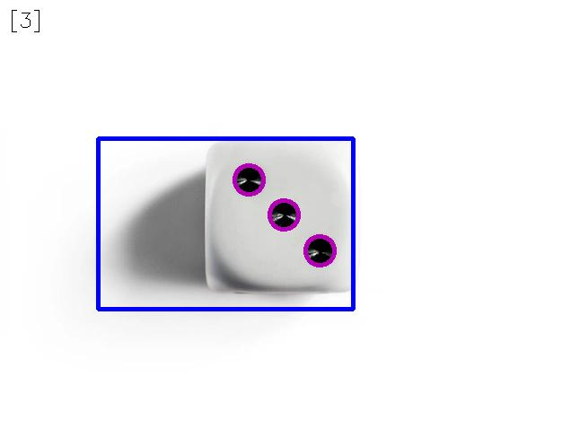
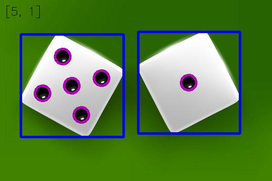
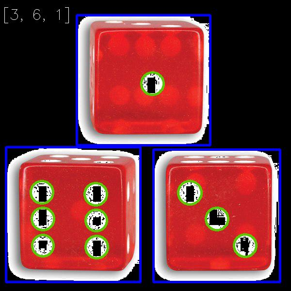
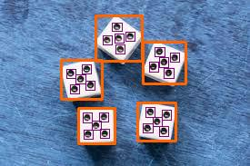

# Assignment 33 : Object Detection

## How to Install
Run following command :
```
pip install -r requirments.txt
```

## First part : Histogram to Image
In this assignment i wrote code that can reconstruct image from a given histogram.

## Second part : Dice Recognition
In this assignment I wrote a code that can count the number of dices and the number of dots in each dice.
A rectangle is drawn around each dice and a circle is drawn around each dot. I also print the number of dices and dots on the picture :









## Thirs part : Implement boundingRect function
In this assignment I implement boundingRect function from scratch. The main code is :
```
x , y , w , h = cv2.boundingRect (contour)
```

## Fourth part : Implement contourArea function
In this assignment I implement contourArea function from scratch. The main code is :
```
area = cv2.contourArea (contours)
```

## Fifth part : Implement findContours function
In this assignment I implement findContours function from scratch. The main code is :
```
contours , _ = cv2.findContours (img , cv2.RETR_EXTERNAL , cv2.CHAIN_APPROX_NONE)
```

## Sixth part : A Funny Webcam Application
In this assignment a picture is in a background and you should fill the nose and lips part by webcam.
