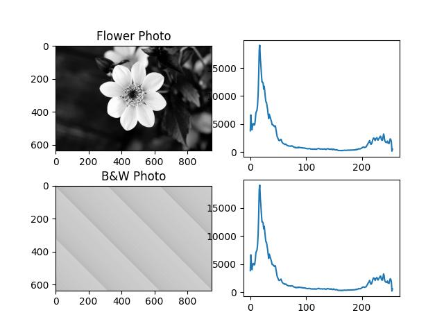
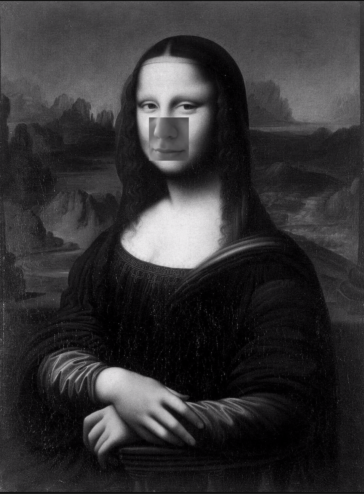

# Assignment 33 : Object Detection

## How to Install
Run following command :
```
pip install -r requirments.txt
```

## First part : Histogram to Image
In this assignment I have been asked to write a code that can reconstruct image from a given histogram.
I must say that it is imposible to reconstruct an image from its histogram, because there are many photos with same histogram.
You can see an example of this content in the following photo :



## Second part : Dice Recognition
In this assignment I wrote a code that can count the number of dices and the number of dots in each dice.
A rectangle is drawn around each dice and a circle is drawn around each dot. I also print the number of dices and dots on the picture :


## Thirs part : Implement boundingRect function
In this assignment I implement boundingRect function from scratch. The main code is :
```
x , y , w , h = cv2.boundingRect (contour)
```

## Fourth part : Implement contourArea function
In this assignment I implement contourArea function from scratch. The main code is :
```
area = cv2.contourArea (contour)
```

## Fifth part : Implement findContours function
In this assignment I implement findContours function from scratch. The main code is :
```
contours , _ = cv2.findContours (img , cv2.RETR_EXTERNAL , cv2.CHAIN_APPROX_NONE)
```

## Sixth part : A Funny Webcam Application
In this assignment a picture is in a background and you should fill the nose and lips part by webcam.
I choose the famous portrait "Mona Lisa" painted by da Vinci as background photo.
The result is a video, but I'll upload an image of the desired final output.

