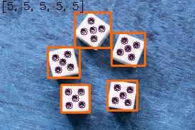

# Assignment 33 : Object Detection

## How to Install
Run following command :
```
pip install -r requirments.txt
```

## First part : 

...

## Second part : Dice Recognition
In this assignment we can count the number of dices and the number of dots in each dice.
I also print the number of dices and dots on the picture :




## Thirs part : 

...

## Fourth part : 

...

## Fifth part : 

...

## Sixth part : 

...