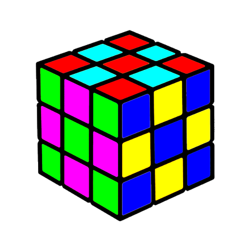

# Assignment 34 : Color Image Processing

## How to Install
Run following command :
```
pip install -r requirments.txt
```

## First part : Conver Color Image to GrayScale Image
In this assignment I wrote a code to convert a color image to a grayscale image. The main code is :
```
gray_image = cv2.cvtColor (image , cv2.COLOR_BGR2GRAY)
```

## Second part : Rainbow
In this assignment I drew a rainbow by opencv library.


## Thirs part : Conver watermelon to Materwelon
In this assignment I convert a picture of watermelon to a materwelon, which means I changed red color to green and green color to red.


## Fourth part : Solving Rubik Cube
In this assignment I used an unsolved rubik cube as an input, and a solved rubik cube will be seen as an output.

input :



output with RGB colors:


output with CMY color :


## Fifth part : ...

