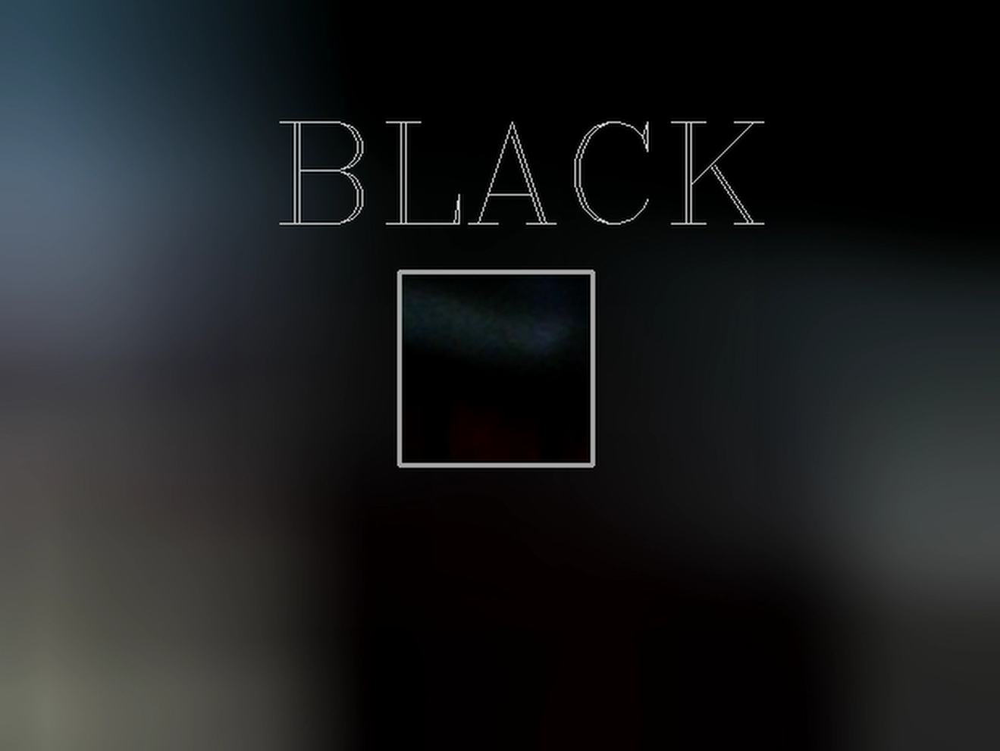
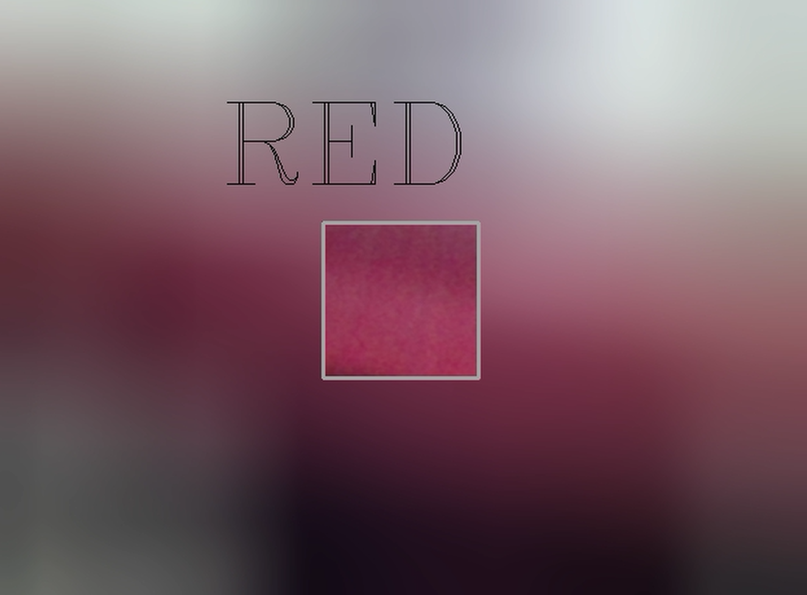
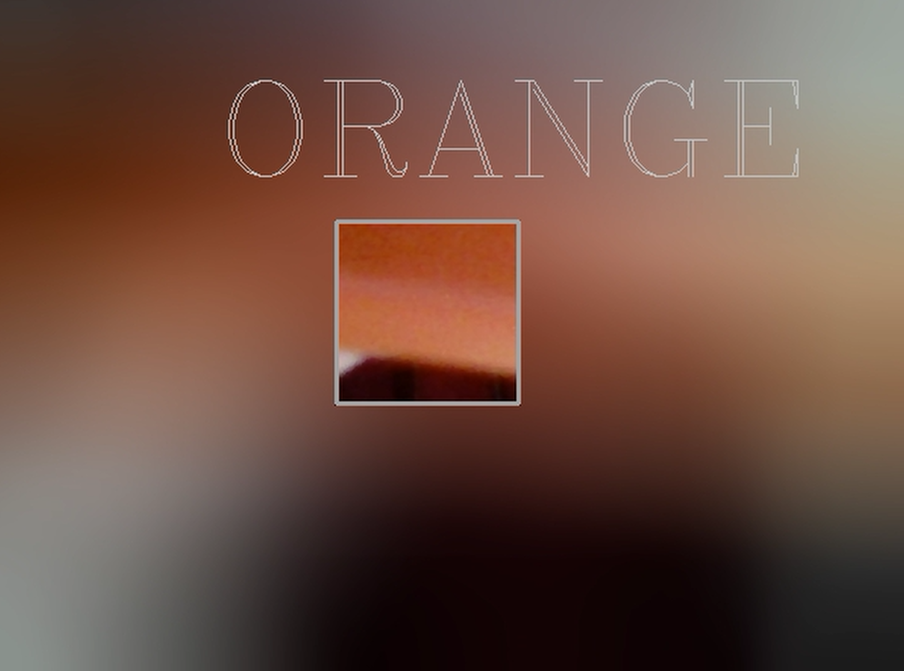
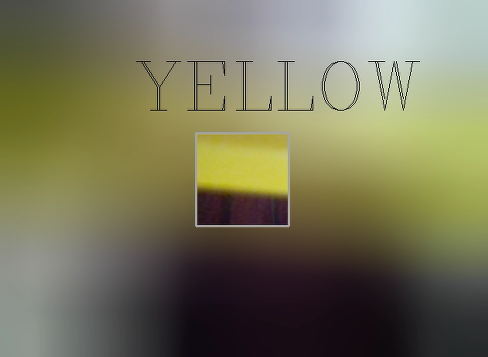
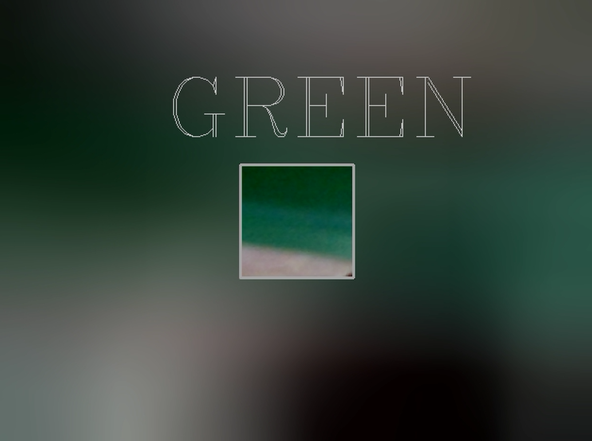
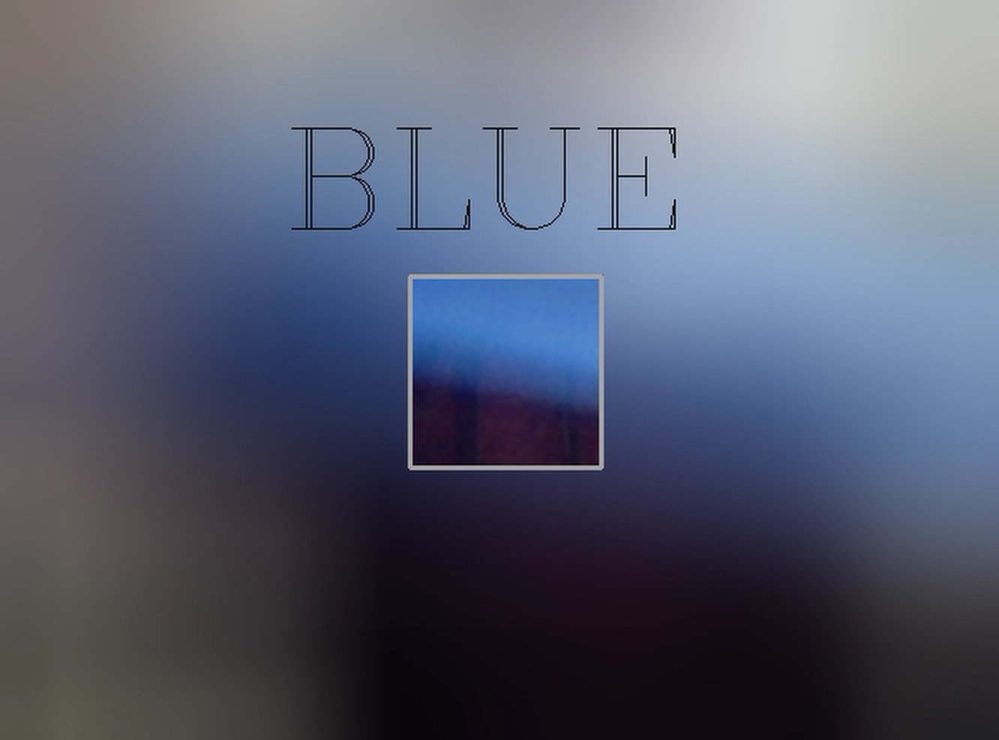
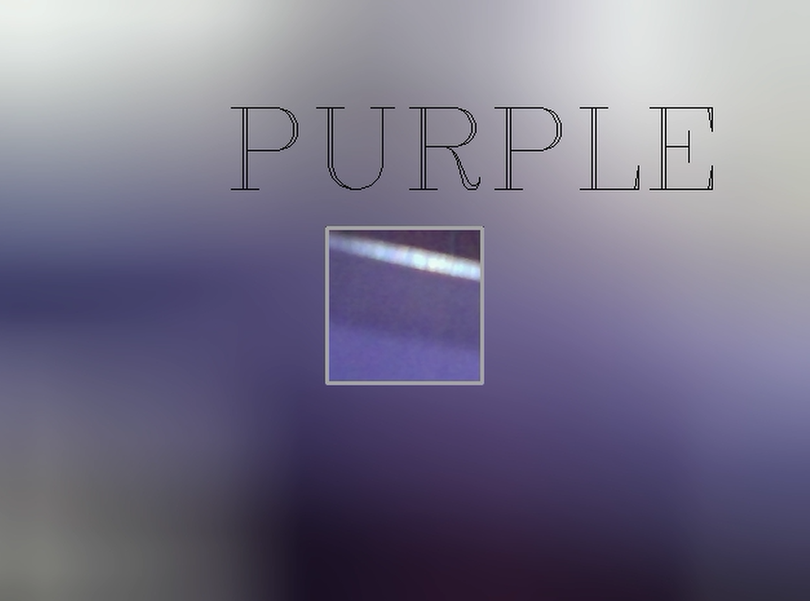

# Assignment 34 : Supplementary Topics

## How to Install
Run following command :
```
pip install -r requirments.txt
```

## First part : Portable Network Graphics
In this assignment my code transparent a Microsoft logo and remove it's background.


## Second part : Color Recognition
In this assignment my code detect different colors, such as : 🔴🟠🟡🟢🔵🟣⚫⚪

⚫ Black color :

⚪ White color :

🔴 Red color :

🟠 Orange color :

🟡 Yellow color :

🟢 Green color :

🔵 Blue color :

🟣 Purple color :


## Third part : MediaPipe
In this assignment I used mediapipe to detect body landmarks on webcam stream :

## Fourth part : PIL (Python Image Library )
In this assignment I used PILLOW (PIL) library to do diffrent analysis on a photo :

1. Read a color image

2. Write a persian text on image

3. Calculate 3 histogram and show with plt

4. Equalize the imge histogram

5. Convert imge to grayscale

6. Calculate grayscale imge's histogram

7. Equalize the grascale histogram

## Fifth part : Image Encryption and Decryption
In this assignment ...
