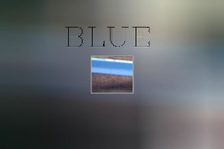
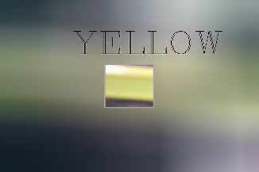

# Assignment 34 : HSV COLOR SPACE

## How to Install
Run following command :
```
pip install -r requirments.txt
```

## First part : Watermelon to Materwelon
In this assignment I used HSV color space to switch the place of red and green color.
Here is my Materwelon :


## Second part : COLOR DETECTION
In this assignment I used HSV color space to detect different color. Here is my outputs :
⚫ Black :


⚪ White :


🔴 Red :


🟣 Purple :


🔵 Blue :



🟢 Green :


🟡 Yellow :



🟠 Orange :


## Third part : Balloons Detection
In this assignment we used a code to detect pink balloons among balloons with different colors.
My input image is :


The output image is :


## Fourth part : ...

## Fifth part : Blue Screen Technique
In this assignment I used HSV color space to change the background of flying superman.
The input image is :


And the output is the superman flying in the sky of Tehran :


## Sixth part : ...

## Seventh part : Spiderman's New Clothe
In this assignment I have been asked to change the color of spiderman's clothe to green and yellow.
By using this parameters I designed three new outfit for him:

🔵🟢 The combination of green and blue clothe


🔵🟡 The combination of yellow and blue clothe


🟢🟡 The combination of green and yellow clothe

